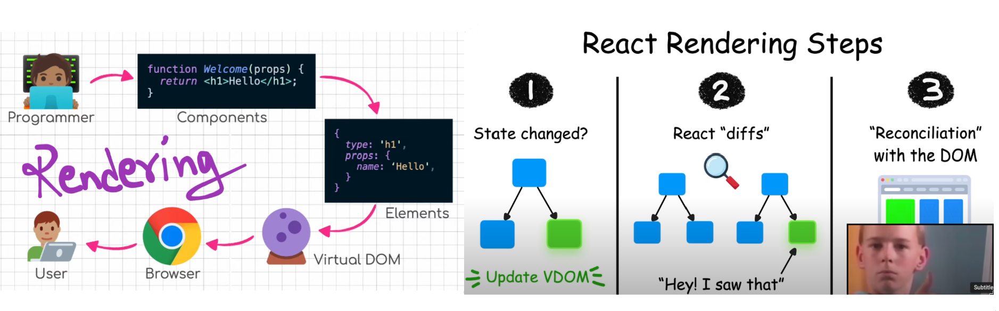
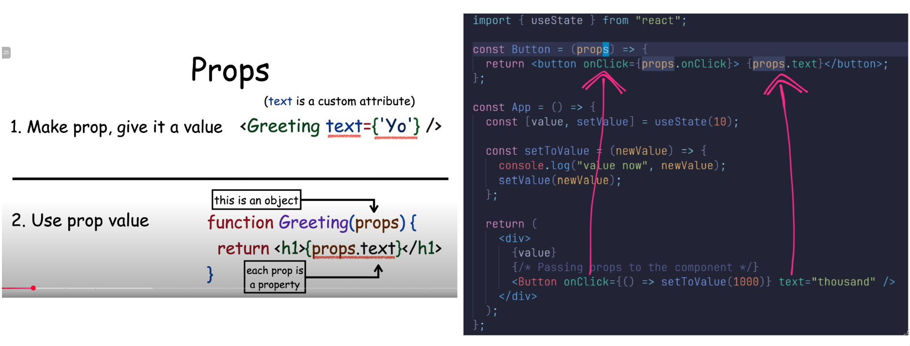

Complex state:
- Saving the click count of both the left and right buttons into a single object:
`const [clicks, setClicks] = useState({
  left: 0,
  right: 0,
});`
- Now the component only has a single piece of state and the event handlers have to take care of changing the entire application state
`const handleLeftClick = () => {
  const newClicks = {
    left: clicks.left + 1,
    right: clicks.right
  }
  setClicks(newClicks)
}`
- It is forbidden in React to mutate state directly
  React follows Unidirectional Data Flow. Meaning, the data flow inside react should and will be expected to be in a circular path
- Changing state has to always be done by setting the state to a new object
  If properties from the previous state object are not changed, they need to simply be copied
  which is done by copying those properties into a new object and setting that as the new state
   Use ...spread to preserve old state when updating objects
- Use objects if the state logically belongs together
- Use separate state if they don’t depend on each other

Handling arrays:
- concat() does not mutate the existing array but rather returns a new copy of the array with the item added to it
- join() returns a new string by joining array elements with a specified separator

Update of the state is asynchronous:
- State update in React happens asynchronously, i.e. not immediately but "at some point" before the component is rendered again 💡

Conditional rendering:
- React elements depending on the state of the application. This is called conditional rendering

Old React: https://react.dev/reference/react/Component

Debugging React applications: 🐞
1. Audit you page
2. Use report to find improvements
3. Introduce changes one by one
4. Audit after each change
- Old-school, print-based debugging is always a good idea
  If the component is not working as intended, it's useful to start printing its variables out to the console
- When you use console.log for debugging, don't combine objects using the plus operator
  Instead, separate the things you want to log to the console with a comma

Rules of Hooks:
- Hooks can only be called inside the body of a function component
- Must not be called from inside of a loop, a conditional expression, or any place that is not a function defining a component
  to ensure that the hooks are always called in the same order, if this isn't the case the application will behave erratically

Event Handling Revisited:
- In order to make the button react to a click event, we have to add an event handler to it
- Event handlers must always be a function or a reference to a function 💡
  Passing the function without calling it
- We must never mutate state directly in React

`<button onClick={console.log("clicked the button")}>btn</button>`
- The message gets printed to the console once when the component is rendered but nothing happens when we click the button
  Why does this not work even when our event handler contains a function console.log?
- The issue here is that our event handler is defined as a function call
  which means that the event handler is assigned the returned value from the function, which in the case of console.log is undefined

`<button onClick={setValue(0)}>button</button>` 🔁 - to fix, set the function to be called on click
- When the component is rendered the function setValue(0) gets executed which in turn causes the component to be re-rendered
  Re-rendering in turn calls setValue(0) again, resulting in an infinite recursion 💡

Executing a particular function call when the button is clicked can be accomplished like this:
`<button onClick={() => console.log("clicked the button")}>btn</button>`
- When the component gets rendered, no function gets called and only the reference to the arrow function is set to the event handler
  Calling the function happens only once the button is clicked
- Defined event handlers in a separate place

A function that returns a function:
- Used to pass parameters when setting event handlers dynamically
`<button onClick={setToValue(1000)}>thousand</button>`

Passing Event Handlers to Child Components:

Do Not Define Components Within Components
- Never define components inside of other components
  The application still appears to work, but don't implement components like this!
- The biggest problems are because React treats a component defined inside of another component as a new component in every render
  This makes it impossible for React to optimize the component

Web programmers oath:
Programming is hard, that is why I will use all the possible means to make it easier
- I will have my browser developer console open all the time
- I progress with small steps
- I will write lots of console.log statements to make sure I understand how the code behaves and to help pinpointing problems
- If my code does not work, I will not write more code
  Instead I will start deleting the code until it works or just return to a state when everything was still working
- When I ask for help in the course Discord channel or elsewhere I formulate my questions properly

https://www.comp.nus.edu.sg/~damithch/pages/SE-quotes.htm
https://egghead.io/courses/the-beginner-s-guide-to-react ...

const App = () => {
  // Function body (variable, state, logic)
  return (
    <>
      {/* JSX content goes here */}
    </>
  );
};

# Vocab
Comprised - Consist of
Concatenate - join
Throttling - Limiting
Baseline - Reference
Flawed - Imperfection
Anecdotes - Short and interesting story
