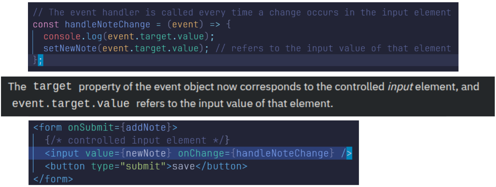

- Collecting data from users, or allowing them to control a user interface
- Validating form data, and submitting data to the server

Saving the notes in the component state:
- To get our page to update when new notes are added it's best to store the notes in the App component's state
- Add an HTML form to the component that will be used for adding new notes
- Also the addNote function as an event handler to the form element that will be called when the form is submitted
`const addNote = (event) => {
  event.preventDefault()
  console.log('button clicked', event.target)
}`
- (e) object containing info about the event which has just occurred
- preventDefault() prevents page reload, allowing manual handling in React
  giving full control over event behavior

Access the data contained in the form's input element?
Controlled component: 💡 Where the form value is handled by React state
`https://react.dev/reference/react-dom/components/input#controlling-an-input-with-a-state-variable`

- Without an onChange handler, React forces the <input> to always show the fixed value, no matter what the user types
- After you assign a piece of the App component's state as the value attribute of the input element
  the App component now controls the behavior of the input element
  <!-- The value field decides whether the form will be controlled or uncontrolled in React -->
- To enable editing of the input element, we have to register an event handler that synchronizes
  the changes made to the input with the component's state
`const handleNoteChange = (event) => {
  console.log(event.target.value)
  setNewNote(event.target.value)
}`

- Note that we did not need to call the event.preventDefault() method like we did in the onSubmit event handler
  This is because no default action occurs on an input change, unlike a form submission
- concat() method immutable
`https://react.dev/learn/updating-objects-in-state#why-is-mutating-state-not-recommended-in-react` - Never mutate state directly

Filtering Displayed Elements:
- New functionality to application that allows us to only view the important notes
- If the value of showAll is false
  the notesToShow variable will be assigned to a list that only contains notes that have the important property set to true
  Filtering is done with the help of the array filter() method

Controlled <input>
- value={} - The input’s value comes from React state <!-- value prop (bound to state) -->
- onChange={} - Every time you type, it updates the state
- State controls input value, not the DOM

NB: When you are working on new functionality, it's often useful to "hardcode" some dummy data into your application
Search Feature ℹ️ https://youtu.be/E1cklb4aeXA?si=UEgYTvzOEHs_wB3j
Do Not Define Component in Another Component

# Vocab
Correspond - Match
Concat - Combine
Idiomatic - Natural
Derived ❌- Obtain
