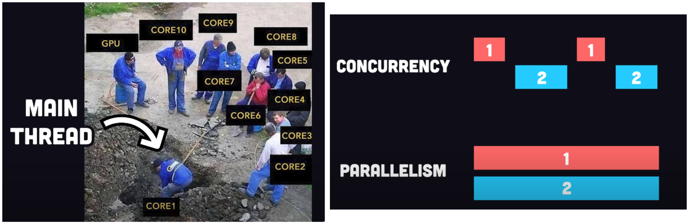

# Why
- The idea will be to save the notes to the server, saving them to the json-server
- The React code fetches the notes from the server and renders them to the screen
- Whenever a new note is added to the application
  the React code also sends it to the server to make the new note persist in "memory"

The browser as a runtime environment:
- The use of XHR is no longer recommended, and browsers already widely support the fetch method
  which is based on so-called promises, instead of the event-driven model used by XHR
- It is worth noting that the code in the event handler is defined before the request is sent to the server
  Despite this, the code within the event handler will be executed at a later point in time
- Time, tide and JS wait for none
- For the browser to remain responsive, i.e., to be able to continuously react to user operations with sufficient speed
  the code logic needs to be such that no single computation can take too long
- latentflip.com/loupe - Visualizing the javascript runtime at runtime
- Today's browsers, it is possible to run parallelized code with the help of so-called web workers
  The event loop of an individual browser window is, however, still only handled by a single thread

<!-- # Core 6 vs Thread 12 -->
<!-- - Thread(s) per core:   2 -->
<!-- - Core(s) per socket:   6 -->
<!--   One core can run multiple threads using Hyper-Threading or SMT (Simultaneous Multi-Threading) -->
<!-- Analogy: 💡 -->
<!-- Core = Chef -->
<!-- Thread = Set of hands that chef uses -->
<!-- If a chef has 2 hands (threads), they can multitask better — but still, it's one chef (core) doing the cooking -->
<!---->
<!-- - Single-threaded: the program (or process) uses only one thread of execution - it can perform only one task at a time -->
<!--  -->
<!-- - Multithreading doesn’t just magically speed everything up -->
<!--   it just splits work across multiple CPU cores when the CPU is doing the heavy lifting -->

NPM:
npm install axios
npm install json-server --save-dev
- Axios is installed as a runtime dependency of the application because the execution of the program requires the existence of the library
- On the other hand, json-server was installed as a development dependency (--save-dev), since the program itself doesn't require it
  It is used for assistance during software development

Axios and promises:
`const promise = axios.get('http://localhost:3001/notes')
promise.then(response => { - An event handler to the promise
  console.log(response)
})`

- The JS runtime environment calls the callback function registered by the then method providing it with a response object as a parameter
- The response object contains all the essential data related to the response of an HTTP GET request
  which would include the returned data, status code, and headers

Effect-hooks: 💡
- Effects let a component connect to and synchronize with external systems
  This includes dealing with network, browser DOM, animations, widgets written using a different UI library, and other non-React code
- As always, a call to a state-updating function triggers the re-rendering of the component
- useEffect takes two parameters. The first is a function, the effect itself
  The second parameter of useEffect is used to specify how often the effect is run
- By default, effects run after every completed render, but you can choose to fire it only when certain values have changed
  If the second parameter is an empty array [], then the effect is only run along with the first render of the component

- Think back to the sequence of events we just discussed
  Which parts of the code are run? In what order? How often? Understanding the order of events is critical!

`useEffect(() => {
  console.log('effect')
  axios
    .get('http://localhost:3001/notes')
    .then(response => {
      console.log('promise fulfilled')
      setNotes(response.data)
    })
}, [])`

The development runtime environment:

# Terms
Idempotent - Doing it many times gives the same result
Pagination – Sending or getting data in chunks (pages) to keep responses fast and light
Event-driven non-blocking !/O model ??
In contrast - Comparison
