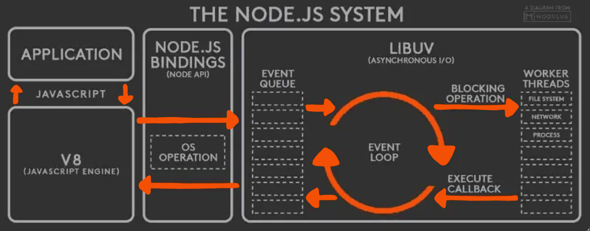

#

- Normally you won't have to think about the low-level details
  you just need to know how events & callbacks work in most cases you'll listen to the events
- Web API Env (in the browser) and libuv (in Node.js)
  handles asynchronous non-blocking operations
- Event-Driven: Sets up "listeners" or "handlers" for specific events
  and when an event happens, it executes their associated callback
- Thread Pool v Worker Threads
  Web Workers 🌐

- Streams
- Cluster
- Env-Var (process.env)
