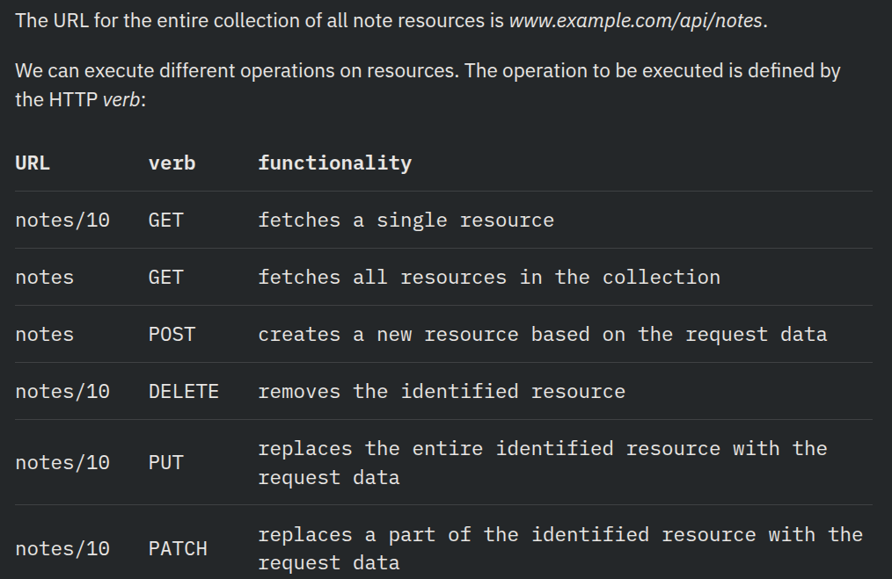

Raodmap - https://youtu.be/iRUkfCzJEgM?si=J1xBjINWk6AdR3L_
# NodeJS, JavaScript runtime based on Google's Chrome V8 JavaScript engine

Transpiler (SWC)
- Converts modern JavaScript to older JS for browser support
  browsers don’t immediately support the newest JavaScript features
- You set the target (es5, es2020) in the config
  to control which version of JS compile down to
- The newest version of Node supports a large majority of the latest features of JS 
  so we can use the latest features without having to transpile our code

Simple web server:
- Node.js uses CommonJS modules by default
- The primary purpose of the backend server in this course is to offer raw data in JSON format to the frontend
- The application/json value in the Content-Type header informs the receiver that the data is in the JSON format
- The notes array gets transformed into JSON formatted string with the JSON.stringify(notes) method 💡
  This is necessary because the response.end() method expects a string or a buffer to send as the response body

Express: Setting up routes and handling requests with middleware
- A template engine combines static HTML with dynamic data, replacing placeholders with actual values at runtime
  to generate the final HTML page sent to the user's browser
- injects server data into HTML using placeholders, like React props
  inject it into pre-designed templates without having to manually build the HTML every time
<!-- - HTML templates are basically HTML files with placeholders (like variables) where data will be inserted -->
<!--   A template engine takes these templates and replaces placeholders with actual data, generating a final HTML page that’s sent to the user -->
<!-- - Yes, exactly! What a template engine does is a form of server-side rendering (SSR) -->
<!-- - Server-Side Rendering (SSR): -->
<!--   For websites where the server generates and serves HTML content (as opposed to sending just data or APIs to be rendered in the browser) -->
<!-- - When Do You Need a Template Engine?:
<!--   Dynamic Pages: When your web pages need to display dynamic content (like user profiles, blog posts, or product pages) -->
<!--   Used to generate dynamic HTML for SSR -->

Middleware: Runs before any route
- Express is a lightweight and flexible routing framework with minimal 💡
  core features meant to be extended through the use of Express middleware modules
- Function that run between the request (from the client) and the response (from the server)
- Express.js is built on top of Node.js’s native http module
- The versioning model used in npm is called semantic versioning^

Web and Express:
- The event handler function accepts two parameters
  Request  - contains all of the information of the client's HTTP request
  Response - used to send back the server's response
- Node, we had to transform the data into the JSON formatted string with the JSON.stringify method:
  `response.end(JSON.stringify(notes))`
  with Express, this is no longer required, because this transformation happens automatically
- Under the hood, JSON is just a string 💡
  
- Node.js comes with a built-in REPL (Read-Eval-Print Loop)
  environment that allows you to execute JavaScript code interactively

https://youtu.be/CVBpYfPKGlE?si=8AWHj-VjCSzGFsu4
REST: Shows the state transfer
- A style of API design (uses HTTP verbs) to perform actions on resources
  You must send all needed info (like ID, Auth token, Request data) with every request
https://youtu.be/EKCM1oQQrCM?si=h3y_RkRvQNifLi_d
https://youtu.be/cJAyEOZQUQY?si=AT2Bf-3zUIaPFYvI

- API Responses — The rule of thumb is to never return plaintext
- Follow server-client architecture — server/client are independent
  Always send JSON (raw data) — not HTML or formatted content & Always respect HTTP methods
<!-- - The singular things, like notes in the case of our application, are called resources in RESTful thinking -->
<!--   Every resource has an associated URL which is the resource's unique address -->
- One convention for creating unique addresses is to combine 💡
  the name of the resource type with the resource's unique identifier
- If we define the resource type of note to be notes then
  the address of a note resource with the identifier 10, has the unique address www.example.com/api/notes/10
   - specific URLs (and methods) that point to different actions
- This is how we manage to roughly define what REST refers to as a uniform interface
  which means a consistent way of defining interfaces that makes it possible for systems to cooperate
<!-- - Lv-2 is more than enough: -->
<!-- https://martinfowler.com/articles/richardsonMaturityModel.html -->
<!-- https://roy.gbiv.com/untangled/2008/rest-apis-must-be-hypertext-driven -->

Fetching a single resource:
- Expand application so that it offers a REST interface for operating on individual notes
- Routing refers to how an application’s endpoints (URIs) respond to client requests
- The unique address we will use for an individual note is of the form notes/10
  where the number at the end refers to the note's unique id number
- We can define parameters for routes in Express by using the colon syntax:
  app.get('/api/notes/:id', ...) will handle all HTTP GET requests that are of the form /api/notes/SOMETHING
- If no note is found, the server should respond with the status code 404 not found instead of 200
- We do not need to display anything in the browser because REST APIs are interfaces that are intended for programmatic use
  and the error status code is all that is needed

Deleting resources:
`app.delete('/api/notes/:id', (request, response) => {
  const id = request.params.id
  notes = notes.filter(note => note.id !== id)
  response.status(204).end()
})`
- If note is missing when deleting, you can return either 204 or 404 there’s no strict rule

Postman:
https://youtu.be/0pk6nOE2JC8?si=wqT8P-mwQ08InFyQ - curl
- Because the notes in the application are only saved to memory
  the list of notes will return to its original state when we restart the application

Receiving data:
- To access the data easily, we need the help of the Express json-parser
  that we can use with the command app.use(express.json())💡
- Request data should be in JSON format this is done by json-parser
  Without the json-parser, the body property would be undefined

- For the time being, the application does not do anything with the received data
  besides printing it to the console and sending it back in the response
- The event handler function can access the data from the body property of the request object
  Everything is handled by middleware and the route handler function (implementing the application logic)

- When programming the backend, keep the console running the application visible at all times
  Naturally, it's a good idea to add lots of console.log commands to the code while the application is still being developed
- A potential cause for issues is an incorrectly set Content-Type header in requests
  This can happen with Postman if the type of body is not defined correctly:
  
  The server appears to only receive an empty object

- The server will not be able to parse the data correctly without the correct value in the header
  It won't even try to guess the format of the data it relies on the Content-Type to know the types
- One benefit of REST client over Postman is that the requests are handily available at the root of the project repository
  and they can be distributed to everyone in the development team
  You can also add multiple requests in the same file using ### separators
<!-- - Problems can occur with the VS REST client if you accidentally add -->
<!--   an empty line between the top row and the row specifying the HTTP headers -->

About HTTP request types:❓
- Safety means that the executing request must not cause any side effects on the server
- All HTTP requests except POST should be idempotent:
  Methods can also have the property of "idempotence" in that (aside from error or expiration issues) the side-effects of N > 0 identical
  requests is the same as for a single request. The methods GET, HEAD, PUT and DELETE share this property
- This means that if a request does not generate side effects, then the result should be the same
  regardless of how many times the request is sent
- POST is the only HTTP request type that is neither safe nor idempotent

Middleware: functions that can be used for handling request and response objects
- Two types of middleware Global middleware & Route specific middleware
- The Express json-parser used earlier is a middleware
- The json-parser we used earlier takes the raw data from the requests that are stored in the request object
  parses it into a JavaScript object and makes the parsed data available on req.body
- In practice, you can use several middlewares at the same time
  When you have more than one, they're executed one by one in the order that they were listed in the application code
- The next() function passes control to the next middleware
- Middleware placed
  Before routes - Parsing, logging, authentication
  After routes  - Error handling, 404 (Not Found)
  `const unknownEndpoint = (request, response) => {
    response.status(404).send({ error: 'unknown endpoint' })
  }
  app.use(unknownEndpoint)`

# To know
Classic confusion in backend development??
- JSON is just a string version of an object

# Terms
<!-- console.log(Math.floor(Math.random() * (max  min  1))  min) -->
Request body: JSON data sent to the server using HTTP methods like POST/PUT
Interface: Set of rules that dictate how different parts of system can interact
Endpoint: A specific URL and method that the client uses to ask the server to do something or return data
- Different URLs (and methods) that point to different actions `GET /api/notes`

# Vocab
Cumbersome: Large or heavy and therefore difficult to carry or use
Intriguing: Fascinating
Idempotent: Repeatable
Yield: Provide
