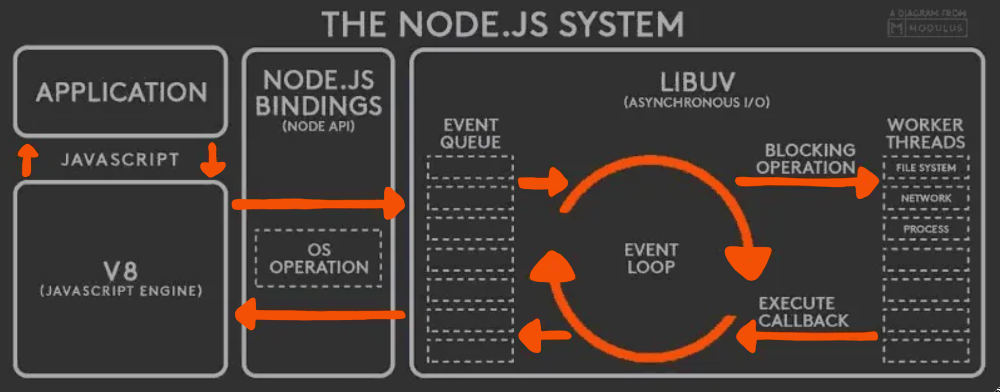

#

- Normally you won't have to think about the low-level details
  you just need to know how events & callbacks work in most cases you'll listen to the events
- Event-Driven: Sets up "listeners" or "handlers" for specific events
  and when an event happens, it executes their associated callback

- Thread Pool vs Worker Threads / Web Workers
- Streams & Buffers
- Child process
- Cluster
<!-- - Env-Var (process.env) -->

# Terms
Concurrency Models
