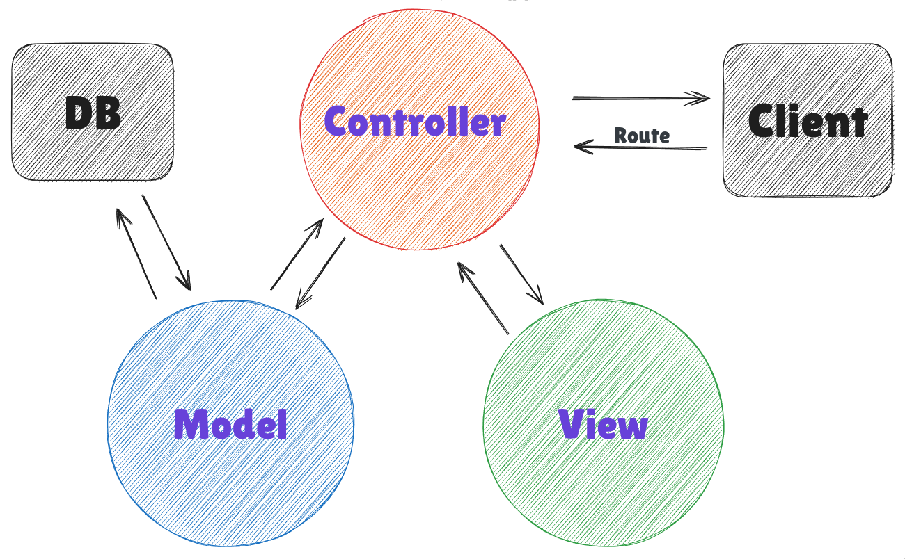
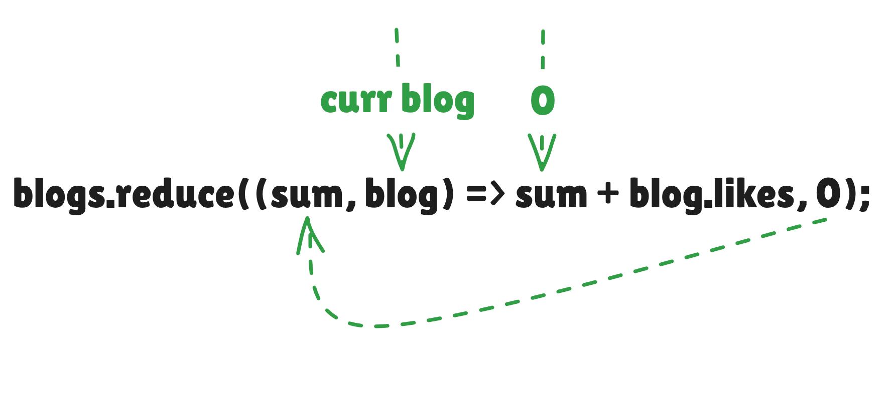

- Unit and integration tests for the backend, implementing user authentication and authorization

# Project structure: Segregate code into separate file/folder
https://youtu.be/JLtXoru-ipo?si=CsQKM4ANGwEw8O7t - MVC pattern
- Before testing, modify the structure of project to adhere to Node.js best practices
- Other parts of the application can access these modules by importing them
- Extracting logging into its own module is a good idea in several ways if we wanted to start writing logs to
  a file or send them to an external logging service like graylog or papertrail we would only have to make changes in one place

├─1 models            # Defines Mongoose schemas
│   └── note.js       # Note schema (import in controller)
├─2 controllers       # Route handlers (logic for each endpoint)
│   └── notes.js      # Handles /api/notes routes (import in app.js)
├─3 utils
│   ├── config.js     # Env vars DB, PORT (import in app.js/server.js)
│   ├── logger.js     # Custom logging functions
│   └── middleware.js # Custom reusable middleware
├── app.js            # Sets up the Express app (middleware, routes)
├── index.js          # Connects to the database & Starts the server

## What are these router objects exactly?
- mini-app only for middleware and routes placed in its own module (declutter app.js)
- The router is a middleware, that can be used for defining "related routes" in a single place

### How to use Router?
controllers/notes.js
- Create router
- Define routes/middleware - Route object must only define the relative parts
- Mount router to app.js

## Finally understood the MVC


https://youtu.be/DUg2SWWK18I?si=dxSrfmxEC6sVAA8H
<!-- - One of the advantages of this structure/method is that the application can now be tested -->
<!--   at the level of HTTP API calls without actually making calls via HTTP over the network -->

## Tips & Tricks
- Right-click on a variable in the location it is exported from and select "Find All References"
  However, if you assign an object directly to module.exports, it will not work
- Murphy's Law: Anything that can go wrong will go wrong
  Refactor application in baby steps and verify that it works after every change you make 🙏
  Don't take shortcut; shortcut will end up taking more time than moving forward slowly and systematically

# Testing Node applications
## Unit tests
 - How to use reduce with an Array of object?
- Comparing objects, the deepStrictEqual method is what you want to use it ensures that the objects have the same attributes
  https://stackoverflow.com/q/16745855/difference-between-equal-deep-equal-and-strict-equal/
  - deepEqual / deepStrictEqual check objects and their properties for value equality, not by reference
- You are bound to run into problems while writing tests
  Remember the things that we learned about debugging
  You can print things to the console with console.log even during test execution

4.6*: Helper Functions and Unit Tests, step 4...

## Types of MERN Stack apps
<!-- - CRUD Dashboards (admin panels, content managers) -->
<!-- - Authentication systems (sign up/login, JWT-based auth) -->
- Form handling and validation
- Role-based access control (admin/user)
- RESTful APIs with Express
- Booking or reservation systems
- Frontend state management (using Context or Redux)

# Terms
The JOEL Test
https://youtu.be/fc6o1gwqZuA?si=qSxBqcc02Zld1r_G - Three-Layer Architecture 

# Lifecycle of Express.js
Client sends HTTP request
    ↓
Express server receives request and creates req, res objects
    ↓
Middleware exe in order (application-level > route-level) ℹ️
Execute application-level middleware (body parser, CORS)
    ↓
Match route (based on method, path)
- if no match > send 404 response
- if matched > continue
    ↓
Execute route-level middleware (authentication, validation) 🔐
- if fail > send 401/403 response (Unauthorized, Forbidden)
- if pass > proceed to route handler
    ↓
Execute route handler
    ↓
Process business logic (DB queries, validations) 🗄️>---------------┐
- if success > send JSON response to client                        |
- if error > pass to error-handling middleware                     |
                                                                   |
# Lifecycle of MongoDB/Mongoose                                    |
Define Mongoose Schema & Create Model (validation, type-checking)  |
    ↓                                                              |
Connect to MongoDB using Mongoose (during app startup)             |
    ↓                                                              |
Express receives HTTP request (CRUD operation)                     |
    ↓                                                              ↓
A Mongoose query is created using model methods (.find(), .save()) 🚂
    ↓
Query executes inside route handler or service layer❗
    ↓
Mongoose compiles/validates query and sends to MongoDB via driver
    ↓
MongoDB processes operation (find, insert, update, or delete)
    ↓
MongoDB returns result (BSON) or error to Mongoose
    ↓
Mongoose transforms BSON into JavaScript objects (documents)?
    ↓
Express handles result or passes error to error-handling middleware  
    ↓
Express sends JSON response to client

# Lifecycle of populate Method
Blog.find({}).populate("user", { name: 1, username: 1 })
    ↓
Mongoose checks Blog schema: does "user" field have ref to another model?
- if Yes > Go to User collection
    ↓
Find User by ObjectId (fetch only name, username fields)
- ObjectId comes from request.body.userId sent in POST /api/blogs
```js
const user = await User.findById(request.body.userId);
user: user._id, // store ObjectId in blog to link user
```
    ↓
Replace ObjectId with selected User fields
    ↓
Return populated blog documents

```js
{
  user: "684b39c1c22a7aab4f91157f" // <-- ObjectId
}
  ↓
{
  user: {
    name: "Sayanta",
    username: "bot",
    id: "684b39c1c22a7aab4f91157f"
  }
}
```
