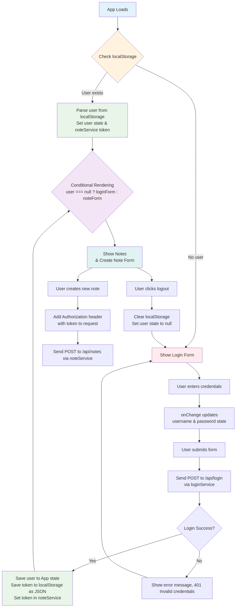

- First looking at different possibilities for testing the React code
- We will also implement token based authentication which will enable users to log in to our application

<!-- - At the moment the frontend shows existing notes and -->
<!--   lets users change the state of a note from important to not important and vice versa -->
<!-- - New notes cannot be added anymore because of the changes made to the backend in part 4 -->
<!--   the backend now expects that a token verifying a user's identity is sent with the new note -->

# Implement user management functionality
- Let's begin with the user login. Throughout this part, we will assume that new users will not be added from the frontend

# Handling user login
## Separating logic into services (like loginService)
## Conditional rendering based on login status 💡
- The app state has fields for username and password to store the data from the form
  The form fields have event handlers, which synchronize changes in the field to the state of the App component
- The event handlers are simple: React by default passes an event object
`({ target }) => setUsername(target.value)` destructure target to save its value to state
- Logging in is done by sending an HTTP POST request to the server address api/login
  Separate the code responsible for this request into its own module, to file services/login.js
- if login is successful, the form fields are emptied and the server response 
  (including a token and the user details) is saved to the user field of the application's state
- Modify the application to show the login form only if the user is not logged-in, so when user === null
  The form for adding new notes is shown only if the user is logged-in, so when user state contains the user's details
  - Use conditional rendering (? :) over logical operators (&&) when choosing between two
  - Forms should be refactored into their own components

# Creating new notes
<!-- - The token returned with a successful login is saved to the application's state -->
<!-- - Fix creating new notes so it works with the backend -->
<!--   This means adding the token of the logged-in user to the Authorization header of the HTTP request -->

# Saving the token to the browser's local storage
## Problem: if the browser is refreshed, the user's login information disappears
## Solution: Save the login details to local storage. Local Storage is a key-value database in the browser
## Why: To keep the details of the logged-in user (like token, theme, ui state, or form data)
- local storage only stores strings, not objects. Parse to JSON first with JSON.stringify 💡
  Correspondingly, when JSON object is read from the local storage, parse back to JS with JSON.parse
  `window.localStorage.setItem('key', 'value')` - getItem(), removeItem()
- Modify application so that on page load, it checks localStorage for logged-in user
  if found, set the App state & API service with the user details (the right way to do this is with useEffect)
- Now a user stays logged in to the application forever
  Add a logout functionality, which removes the login details from the local storage

<!-- How to create react component? -->
<!-- How to connect backend with proxy -->
<!-- What's the diff between proxy and cors -->

# To-Know
- React re-renders component only when its state or props change
`event.preventDefault()` // Stop default form behavior like reloading the whole page. i want to handle custom submission
`onChange={({ target }) => setUsername(target.value)}` // Update username state as user types in input field

<!-- onChange == event listener -->
<!-- handleLogin == event handler -->
- An object can have one event handler for a specific event 
  but it can have multiple event listeners for the event

# Exercise
## Frontend for Blog App
<!-- - Connect your backend with a proxy -->
<!-- - Implement login functionality to the frontend -->
<!--   The token returned with a successful login is saved to the application's state user -->
<!-- - If a user is not logged in, only the login form is visible -->
<!-- - Implement a way to log out -->
<!-- - Expand your application to allow a logged-in user to add new blogs -->
<!-- - Implement notifications that inform the user about successful and unsuccessful operations -->
