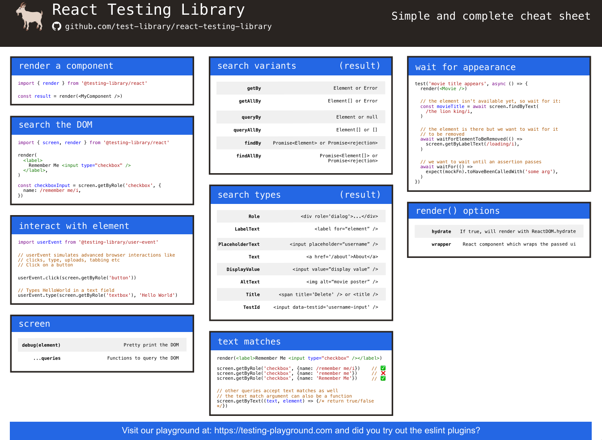

- install React-Testing-Library: renders components in the jsdom environment
  `npm install vitest jsdom --save-dev
  npm i @testing-library/react @testing-library/jest-dom --save-dev
  npm install --save-dev @testing-library/user-event`
- configure jsdom in vitest.config.js: simulates a web browser environment
  `test: {
    environment: "jsdom",
    globals: true, // no need to import keywords such as describe, test and expect into the tests
    setupFiles: "./testSetup.js", // cleanup function to reset jsdom after each test
  }`

https://testing-library.com/docs/react-testing-library/cheatsheet/

<!-- ## Queries to Get Elements -->
<!-- getBy → throws if not found (when element must exist) -->
<!-- queryBy → returns null if missing (when element might not exist) -->
<!-- findBy → async, returns a Promise (when element appears later) -->

# Rendering the component for tests
## Complete Frontend Testing Lifecycle
Setup test data and mocks
- Add className/id/data-* to query the component (if needed)
- Create mock functions (vi.fn for props/handlers)
- Prepare input data, props, and mock objects (simulate input/state)

Render the component using render() function
- Provide necessary props, context providers, or wrappers

Element Querying & Selection
- Use screen's methods to search for an element
- and also the querySelector

User interaction
- Simulate user actions with userEvent.click(), userEvent.type()
- Use Vitest’s mock functions to assert how many times event handlers are called

Assertions & Testing
- Use vitest's expect command to check existence of an element

* Expect creates an assertion, the validity of which can be tested using various condition functions
https://vitest.dev/api/expect.html#expect

💡 setup → render  → query → (interact) → (wait) → (re-render) → verify → cleanup

## Searching for content in a component
- The react-testing-library offers many different ways of investigating the content of the component being tested
  * We could also use CSS-selectors to find rendered elements
    by using the method querySelector of the object container that is one of the fields returned by the render
    * Container is just a reference to the root DOM element where the component was rendered
- A more consistent way of selecting elements is using a data attribute that is specifically defined for testing purposes

# Debugging tests
<!-- - screen.debug() print the HTML of a component to the terminal console.log(DOM()) -->
<!-- - It is also possible to use the same method to print a wanted element to console -->

# Clicking buttons in tests
- user-event library makes simulating user input
- Mock objects and functions are used stub components in testing that are used for replacing dependencies of the components being tested
- Spy observes function calls without changing the original behavior 💡

# Tests for the Togglable component
- The toHaveStyle method

# Testing the forms
- We used the click function of the user-event in our previous tests to click buttons
- We can also simulate text input with userEvent
- The good old console.log works as usual in the tests

## About finding the elements
- Find the right input field with the method getByPlaceholderText
- The most flexible way of finding elements in tests is the method querySelector of the container object, which is returned by render 💡
- However, we shall stick to the approach of using getByPlaceholderText in the test??

# Test file location
<!-- https://jefflongbeard.medium.com/organizing-tests-in-jest-17fc431ff850 -->
<!-- - Write test in the same directory as the component itself -->
<!--   this is configured by default in applications created by Vite -->
<!-- - The other convention is to store the test files "normally" in a separate test directory -->

# To-Know
Vitest 🧪 = defines & runs tests  
RTL 🧩 = renders & interacts with components

How to write test names?
- test("does [something] when [action/condition]", () => {})

Queries → Matcher??

- Classic interaction test??

<!-- mock.calls[0] gets the array: [{ content: "testing a form..." }] -->
<!-- mock.calls[0][0] gets the first item from that array: { content: "testing a form..." } -->
