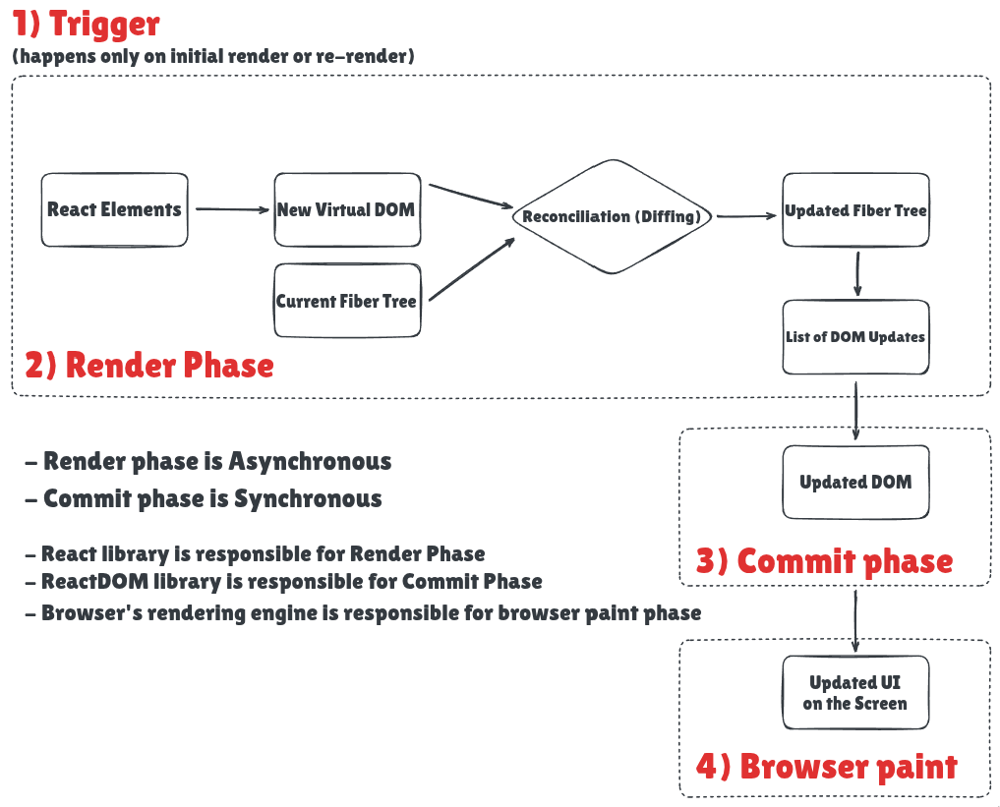

https://www.deepintodev.com/blog/how-react-works-behind-the-scenes
https://youtu.be/7YhdqIR2Yzo?si=UAkZFaKV2QiVaT-m

Why useState instead of just variables?

# Virtual DOM: Just JavaScript objects
- Why the real DOM is slow for frequent updates: When you make changes to the real DOM
  it often triggers reflows and repaints of the webpage, which are computationally expensive operations
- React elements are just objects that are returned by React.createElement() function calls

# Fiber Tree: Virtual DOM with superpowers
- An internal data structure that implements React's reconciliation algorithm with advanced scheduling capabilities
- A linked list structure that enables incremental rendering and holds additional metadata

# Reconciliation & Diffing Algorithms
Reconciliation: The overall process React uses to update the UI following data changes
Diffing: A part of the reconciliation process, the algorithm that compares previous and new trees
- First Rule of Diffing Algorithm: Two elements of different types will produce different trees 💡
  But what if React doesn't see a different element in the same position?
  - The element will be kept in the tree (as well as its child elements and its state)
  - New props/attributes are passed if they changed between renders

- However, this isn't something that we always want. We actually want to "reset" the state even when it's the "same position, same element
  How can we achieve this reset behavior? This is where the second rule of React's diffing algorithm comes into play
  Elements w/ a diff key prop do not remain the same across renders
  And, elements with a stable key prop maintain their identity across renders

# What is the key prop?
- Special property that we use to inform the diffing algorithm that an element is unique
  When the key changes between renders, the element will be destroyed and a new one created
  (even if its position in the tree remains unchanged)
- Thanks to the key prop. React recognizes distinct two components, even though they occupy the same position across renders

There's also a second use case for the key prop:
- When a key value remains consistent across renders
  The element will be preserved in the DOM (even if its position changes in the tree changes)
  This is actually why we use the key prop in lists

# Recap
 - The render phase can be asynchronous, the commit phase is strictly synchronous!
- Figure out how the React Element will turn into an actual DOM Element?
- if you don't want the Child to re-render when parent component renders, then you can wrap the Child in React.memo()
- The component that writes the results to the actual DOM is a library called ReactDOM/React Native
