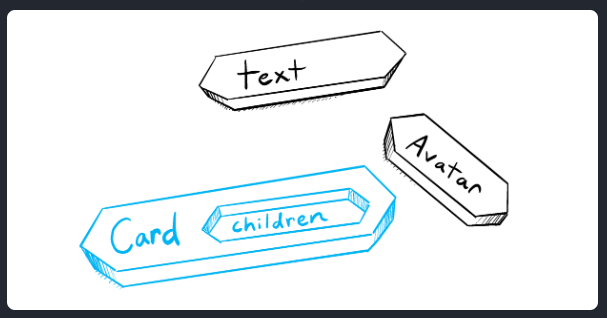

#
- Make components reusable, use the same component with different values
- React components use props to communicate with each other
  Every parent component can pass some information to its child components by giving them props
  like HTML attributes, but you can pass any JavaScript value through them, including objects, arrays and functions

Step 1: Pass props to the child component
# export default function Profile() {
#   return (
#     <Avatar
#       person={{ name: 'Lin Lanying', imageId: '1bX5QH6' }} // (an object)
#       size={100}
#     />
#   );
# }

Step 2: Read props inside the child component
- This lets you use them inside the Avatar code, like you would with a variable
# function Avatar({ person, size }) {
#   // person and size are available here
# }
- Props let you think about parent and child components independently
  For example, you can change the person or the size props inside Profile without having to think about how Avatar uses them
  Similarly, you can change how the Avatar uses these props, without looking at the Profile
- You can think of props like “knobs” that you can adjust
  They serve the same role as arguments serve for functions—in fact, props are the only argument to your component!

Usually you don’t need the whole props object itself, so you destructure it into individual props
# function Avatar({ person, size }) {
#   // destructuring is equivalent to reading properties from a function parameter
# }

# function Avatar(props) {
#   let person = props.person;
#   let size = props.size;
# }

Specifying a default value for a prop: Default value to fall back on when no value is specified
- function List({ category = "Category", items = [] }) // default props
# function Avatar({ person, size = 100 }) {
#   // Now, if <Avatar person={...} /> is rendered with no size prop, the size will be set to 100
# }

Forwarding props with the JSX spread syntax:
- Sometimes, passing props gets very repetitive
- Some components forward all of their props to their children
  Because they don’t use any of their props directly, it can make sense to use a more concise “spread” syntax
# function Profile(props) {
#   return (
#     

#       <Avatar {...props} />
#     

#   );
# }
- If you're using spread syntax in every other component, something is wrong
  Often, it indicates that you should split your components and pass children as JSX

Passing JSX as children: 💡
- When you nest content inside a JSX tag, the parent component will receive that content in a prop called children
- Here, the Card component below will receive a children prop set to <Avatar /> and render it in a wrapper div:

- You can think of a component with a children prop as having a “hole” that can be “filled in” by its parent components with arbitrary JSX
  You will often use the children prop for visual wrappers: panels, grids, etc

How props change over time: 💡 Update when the parent’s state changes
- Component may receive different props over time. Props are not always static!
- Props reflect a component’s data at any point in time, rather than only in the beginning
- Props are immutable. Don’t try to “change props” — you will need to “set state”
- When a component needs to change its props (for example, in response to a user interaction or new data)
  it will have to “ask” its parent component to pass it different props—a new object!
  its old props will then be removed, and eventually the JavaScript engine will reclaim the memory taken by them

# Vocab
Omitted - not included
