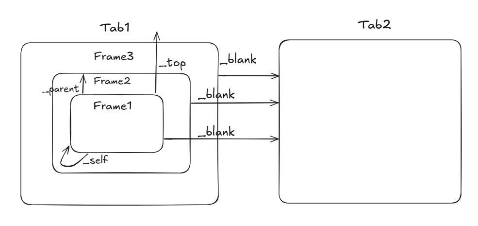

# ⚓Anchor
<!-- Element   - Box -->
<!-- Property  - Label on the box -->
<!-- Attribute - Letter -->
<!-- Different elements have different attributes -->

Hypertext REFerence
Root-relative links are some of the most useful kinds of links

Slugs are page's title but simplified and optimized (SEO-friendly)
- The names of folders and files determine the slugs for web pages
- They’re visible to the user, which means you should put in as much effort into naming your files

Image Dimensions
Aspect-ratio
# - Height = (W ÷ Aspect Ratio W) x Aspect Ratio H
# - Width  = (H ÷ Aspect Ratio H) x Aspect Ratio W
#   - Height = 1920 ÷ 16 x 9
#   - Width  = 1080 ÷ 9 x 16

# HTML Entities - &used to represent reserved chars or chars not available on your keyboard;
# Start thinking of a website as a beautiful way for users to navigate the folders and files we create as part of the web development process

# Vocab
Vantage: A place or position affording a good view of something
Implied: Suggested but not directly expressed; implicit
Impairment: Damage
